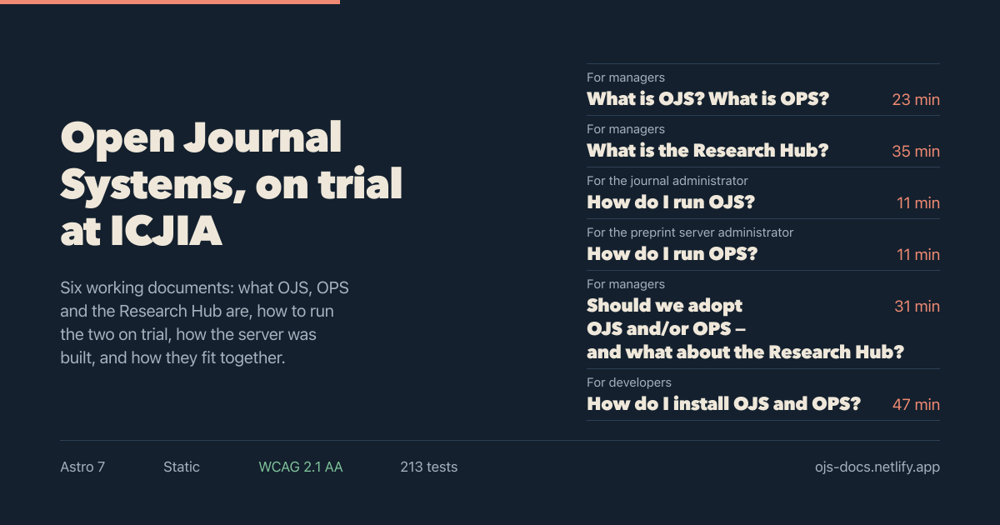
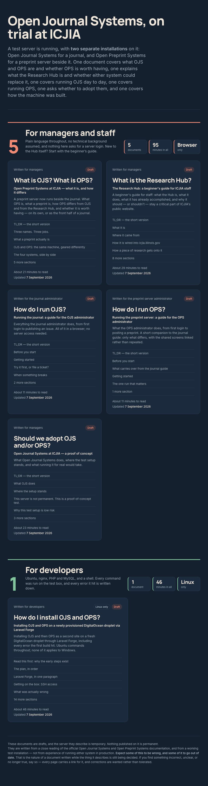
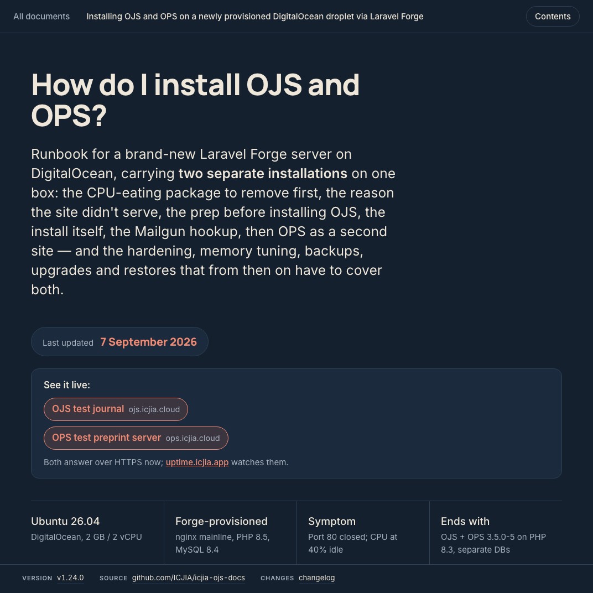

<p align="center">
  
</p>

<h1 align="center">ICJIA OJS documentation portal</h1>

<p align="center">
  <a href="https://github.com/ICJIA/icjia-ojs-docs/actions/workflows/ci.yml"></a>
  <a href="https://app.netlify.com/projects/ojs-docs/deploys"></a>
  <a href="https://ojs-docs.netlify.app"></a>
  <a href="https://github.com/ICJIA/icjia-ojs-docs/releases"></a>
  <a href="#accessibility"></a>
  <a href="#tests"></a>
  
  <a href="LICENSE"></a>
</p>

A portal for the working documents about the ICJIA
[Open Journal Systems](https://pkp.sfu.ca/software/ojs/) evaluation. Built with
[Astro](https://astro.build) 7, deployed to Netlify on every push to `main`.

Three documents are published today — an overview for managers, a guide for the
journal administrator, and an installation runbook for developers — and the
portal is built so that adding a fourth is a one-line change.

Every page meets **WCAG 2.1 Level AA**. See [Accessibility](#accessibility)
before changing any styling.

<p align="center">
  <a href="https://ojs-docs.netlify.app">
    
  </a>
</p>

<p align="center"><em>The portal. Each card's sections, counts, reading time and date are read out of the document itself at build time.</em></p>

<p align="center">
  <a href="https://ojs-docs.netlify.app/docs/droplet-runbook/">
    
  </a>
</p>

<p align="center"><em>A wrapped document. The header, contents panel and reading-progress bar are added by the build; everything below is the source file, unmodified.</em></p>

## Adding a document

1. Put the HTML file in `src/documents/`.
2. Append an entry to `documents` in [`src/content/documents.ts`](src/content/documents.ts):

   ```ts
   {
     slug: 'backup-policy',             // becomes /docs/backup-policy/
     file: 'backup-policy.html',        // filename in src/documents/
     question: 'How do we restore it?', // the reader's question, shown large on the card
     summary: 'One line about what is inside.',
     audience: 'Written for developers',
     status: 'draft',
     note: 'Linux only',              // optional qualifier chip; omit if not needed
     order: 4,
   }
   ```

That is the whole job. The title, section list, subsection counts, reading time,
last-updated date, table of contents and route are all read out of the HTML at
build time, so they cannot drift out of date with the document. The accessibility fixes described
below are applied by the wrapper, so a new document inherits them automatically.

The build fails with a clear message if a manifest entry points at a file that
does not exist, or if two entries share a slug.

`audience` and `status` are free-form strings. Known values get a colour and
anything else falls back to a neutral style, so a new audience needs no code
change.

## How documents are handled

Source documents are **never modified by the build**. Each one is a complete,
self-contained HTML file that still opens correctly on its own or as an email
attachment.

At build time [`src/lib/parse-document.ts`](src/lib/parse-document.ts) takes a
document apart and the shell reassembles it inside portal chrome:

| Taken from the document | Where it ends up |
| --- | --- |
| `<title>` | page title, header, card |
| `<link>` tags | back into `<head>`, so its webfonts still load |
| `<style>` contents | inline in `<head>`, **before** the chrome's stylesheet |
| `<body>` markup | inside the portal shell |
| `<script>` contents | re-emitted verbatim at the end of the page |
| `h2` / `h3` | given ids, which drive the contents panel and card outline. An id never begins with a digit, because `#40-…` is not a valid CSS selector |
| `pre` / `table` | made keyboard focusable, since they scroll |
| `pre` | given `role="group"` and a label, so the focus stop announces itself |
| `<time datetime>` | read as the document's last-updated date and shown on its card |

Because the documents declare global CSS (`body`, `h1,h2,h3`, `a`, `section`),
every chrome element uses a `px-` class prefix and the chrome stylesheet is
emitted after the document's own, so class specificity wins. The chrome also
reads the document's own custom properties (`--ink`, `--rule`, `--pencil`) with
fallbacks, so it stays visually in key with whatever it wraps.

## Accessibility

All pages pass **WCAG 2.1 AA**, verified in production on desktop and mobile
with axe-core, Lighthouse and a contrast checker — zero violations, 100/100 —
plus manual checks for the criteria those tools cannot detect.

Eight things in [`src/styles/document-shell.css`](src/styles/document-shell.css),
[`parse-document.ts`](src/lib/parse-document.ts) and the document shell's inline
script exist purely to hold that line. They look removable and are not:

| Rule | Why it is there |
| --- | --- |
| `.px-doc * { min-width: 0 }` | Grid and flex items default to `min-width: auto`. One long shell command in a `1fr` track sized the track to the whole command and scrolled the page sideways. This is a no-op for every other box. |
| `overflow-wrap: anywhere` on inline code | A URL with no break opportunity pushed the runbook 201px past a 320px viewport, failing **1.4.10 Reflow**. Block code in `pre` is deliberately excluded so commands stay copyable. |
| `tabindex="0"` on `pre` and `table` | Those regions scroll horizontally, and a scrollable region must be reachable by keyboard (**2.1.1**). `pre` also gets `role="group"` and a label; `table` deliberately does not, because overriding a table's role costs row and column navigation. |
| `:focus-visible` outlines | **2.4.7**, and it keeps one focus indicator across chrome and document. |
| Skip links, `position: fixed` when focused | **2.4.1**. Absolute positioning pins them to the top of the document, so one focused after scrolling sits outside the viewport. |
| Only the card heading is a link | Wrapping the whole card gives it a sixty-word accessible name; labelling that anchor instead fails **2.5.3 Label in Name**. A stretched pseudo-element keeps the card clickable. |
| Contents links drive their own scroll | Native smooth scrolling took about four seconds across the runbook and moved nothing for the first second, so a reader who nudged the wheel cancelled it mid-flight — measured at 399px past the target, behind the header. The animation is bounded and starts within ~90ms. |
| The landing position is recomputed on arrival | A long document shifts under the animation; one jump finished 251px short, which put the heading back under the header. Trusting the figure from click time reintroduces the bug it fixes. |

Contrast is tight by design. The accent `--pencil` (`#f08a72`) was chosen as the
lightest-touch value that clears 4.5:1 against every background it sits on,
including the tinted `--pencil-soft` chips where the original coral measured
3.82:1. The print blocks use a darker `#a83d27`, because on white the screen
accent gives 2.45:1. **Do not restore the earlier `#e8735a`.**

To re-verify after a change, build and serve, then audit both viewports:

```bash
npm run build && npm run preview
# then point axe-core / Lighthouse / a contrast checker at:
#   http://localhost:4321/
#   http://localhost:4321/docs/ojs-proof-of-concept
#   http://localhost:4321/docs/ojs-administrator-guide
#   http://localhost:4321/docs/droplet-runbook
```

Automated tools cover roughly half of WCAG. Reflow, text spacing and keyboard
behaviour were checked by hand, and `tests/screen-reader.test.ts` asserts the
semantics assistive tech reads. Driving NVDA or VoiceOver with a human listener
is the remaining gap a formal ADA Title II / IITAA review would expect.

## Security

<!-- CONVENTION: newest pass first. When adding a new pass, wrap the one below in
     <details><summary>Red/blue pass — YYYY-MM-DD</summary> … </details> and put
     the new pass here, expanded. -->

### Red/blue pass — 2026-09-05

Threat model unchanged: **a static site with no server, no database, no
accounts, and no user input.** This pass re-ran every check from the previous
one and concentrated on what has changed since — a new comparison section
carrying the first outbound links added in months, and the guard that vets
them.

**Red — what was found**

| | Finding | Outcome |
| --- | --- | --- |
| R1 | The origin guard matched `href="https://…` and nothing else, which is one of at least seven ways to write the same reach. Measured against the old pattern, six forms passed unseen: single-quoted, unquoted, `href = "…"` with spaces, protocol-relative `//host`, `srcset` candidates, and form `action`. A document could have linked anywhere through any of them and the suite would have stayed green. | **Fixed.** The scan now reads `srcset`, `formaction`, `poster`, `action`, `href` and `src`, quoted either way or not at all, with an optional scheme, plus CSS `url()`. Hosts are lowercased (DNS is case-insensitive; the allowlist was not), and userinfo stays attached so `github.com@evil` fails rather than passing as its prefix. Each evasion is pinned as a fixture — 19 new tests. |
| R2 | The comparison links to two Hub 2.0 drafts on `*.netlify.app`, now allowlisted. Both are temporary by design, so the links rot when the previews come down — and `*.netlify.app` is a shared namespace, so a released site name can be claimed by anyone while the allowlist still blesses the host. | **Accepted, with a review trigger.** Revisit at Hub 2.0 cutover: either repoint at the production addresses or drop the links. Recorded here so the trigger is not left to memory. |
| R3 | Third-party actions are pinned to floating tags (`actions/checkout@v4`, `actions/setup-node@v4`). `release.yml` runs with `contents: write` and `github.token`, so a moved tag would execute in a job that can create tags and releases. | **Open.** Both are first-party GitHub actions, so exposure is low; SHA-pinning is the cheap standard mitigation and is worth doing. |
| R4 | `Strict-Transport-Security` is not in [`netlify.toml`](netlify.toml). It is live — verified against the deployed site — but it comes from Netlify's platform default, not from anything in this repository. Moving hosts would drop HSTS silently. | **Accepted.** Noted so it is a known dependency rather than a surprise. |
| R5 | `actions/checkout@v4` and `actions/setup-node@v4` target Node 20, which GitHub has deprecated and now force-runs on Node 24. | **Open, operational.** Not a vulnerability; it will break when forced runs end. |
| R6 | Carried forward from the previous pass and unchanged: the runbook publishes the test hostname and `forge` login user (**accepted** — disposable box), and staff first names are public (**accepted, by instruction** — no surnames, enforced by test). | **Accepted.** |

**Blue — what held**

- `npm audit`: **0 vulnerabilities.** Three runtime dependencies, four dev, 295 entries in the installed tree, one with an install script (`esbuild`).
- **No credential pattern anywhere in history** — the full log scanned for AWS keys, GitHub classic and fine-grained tokens, Slack, Stripe, Google API keys and private-key headers.
- No `.env`, `.pem`, `.key`, `.p12` or keystore file has ever been committed, and none exists now.
- The published artefact is **eight files**. Three email addresses appear, all three explicitly allowlisted with a stated reason — two role mailboxes and one SSH login — and anything else is treated as a leak.
- `nginx.org` and `ojs.icjia.cloud` appear in published text but **never as an `href`**: prose, not reachable origins. Useful confirmation that the widened scan does not fire on prose.
- [`release.yml`](.github/workflows/release.yml) was already hardened: the version is validated against strict semver before it reaches a shell, values are passed by environment rather than interpolation, and it refuses a failed CI run, an existing tag, or a missing changelog entry. CI itself runs `contents: read`.
- All six headers live and verified against the deployed site, HSTS included: `max-age=31536000; includeSubDomains; preload`.
- **The headers are now enforced, not just verified.** They had no test coverage at the time of this pass — deleting the CSP line kept CI green — so [`tests/deployment-config.test.ts`](tests/deployment-config.test.ts) was added the same day, along with the check that the policy and the origin allowlist cannot drift apart. Ten further probes confirmed each new assertion fails when the thing it guards is broken.

**Verified by attack, not assumption**

Ten payloads were planted in a real document one at a time, each run against
the full suite. All ten were caught, and the document restored clean.

| Attack | Caught by |
| --- | --- |
| Hostile inline `<script>` exfiltrating cookies | script SHA pin |
| Inline `onmouseover` handler | inline-handler guard |
| `javascript:` URL | `javascript:` guard |
| Remote `<script src>` | remote-script guard |
| `<iframe>` | iframe guard |
| `<object data>` | object/embed guard |
| Tracking pixel to an unknown origin | origin scan |
| Protocol-relative link `//evil.example` | origin scan — **would have passed before R1** |
| Single-quoted unknown origin | origin scan — **would have passed before R1** |
| Form posting offsite | origin scan — **would have passed before R1** |

<details>
<summary><b>Red/blue pass — 2026-09-04</b></summary>

Threat model in one line: **a static site with no server, no database, no
accounts, and no user input.** Everything below is scoped to that.

**Red — what was found**

| | Finding | Outcome |
| --- | --- | --- |
| R1 | A document's own `<script>` is re-emitted onto the published page. That is deliberate — the runbook's copy buttons need it — but it means adding a file to `src/documents/` adds JavaScript to production, and a reviewer skimming 60 KB of hand-written HTML can miss a script tag. | **Fixed.** Scripts are pinned by SHA-256 in [`tests/document-scripts.test.ts`](tests/document-scripts.test.ts). Any new or altered script fails the build until someone approves it deliberately. Inline handlers, `javascript:` URLs, remote scripts, iframes, `object`/`embed`, and unknown outbound origins are refused outright. |
| R2 | No Content-Security-Policy. | **Fixed**, with a stated limit: the documents carry their own inline `<style>` and one carries an inline `<script>`, so `script-src`/`style-src` keep `'unsafe-inline'` pending build-time hashing. The rest bites — `object-src 'none'`, `base-uri 'none'`, `form-action 'none'`, fonts restricted to the two Google hosts. |
| R3 | The site could be framed. | **Fixed.** `frame-ancestors 'none'` plus `X-Frame-Options: DENY`. |
| R4 | No `Permissions-Policy`. | **Fixed.** Camera, microphone, geolocation and cohort tracking denied. |
| R5 | The runbook publishes the test hostname, nginx paths, config layout and the `forge` login user. | **Accepted.** It is a runbook; the box is documented as temporary and disposable. Worth revisiting if that host outlives the proof of concept. |
| R6 | Staff first names and roles are public. | **Accepted, by instruction.** No surnames and no personal email addresses — enforced by a test, verified at 0 across all pages. |

**Blue — what held**

- `npm audit`: **0 vulnerabilities**. Three runtime dependencies, four dev, 226 transitive, 2 with install scripts.
- No adapter, no serverless functions, no database, no authentication, no user input. The published artefact is eight files on a CDN.
- **No credential pattern in any commit** — full history scanned against AWS, GitHub, Slack, Stripe, Google, private-key and generic-base64 patterns.
- No `.env`, `.pem`, `.key` or credential file has ever been committed.
- Every credential in the documents is a placeholder (`YOUR_DB_PASSWORD`, `"the-mailgun-SMTP-password"`).
- **Zero inline event handlers** on any published page; the portal page ships no JavaScript at all.
- A build-time test already blocks personal names, unexpected email addresses and credential patterns from reaching published HTML.
- HSTS with `preload`, `nosniff` and `Referrer-Policy` were already live.

The guards were verified by attacking them, not assumed. A hostile `<script>`,
an `onmouseover` handler, and a tracking pixel to an unknown origin were each
injected into a document; each was caught by the assertion meant to catch it.
The shared footer was checked the same way — rewording one and dropping one
issues link both fail.

</details>

## Commands

| Command | What it does |
| --- | --- |
| `npm run dev` | Start the dev server at `localhost:4321` |
| `npm run dev:open` | Same, and open a browser |
| `npm run dev:host` | Same, exposed on the local network |
| `npm run build` | Build the static site to `dist/` |
| `npm run preview` | Serve the built `dist/` locally |
| `npm test` | Run the full test suite |
| `npm run test:watch` | Run tests in watch mode |
| `npm run check` | Astro type and template diagnostics |

Every one of these runs in CI on pull requests and pushes to `main`
([`ci.yml`](.github/workflows/ci.yml)). Netlify only runs `npm run build`, so
without CI nothing would check the pins described under
[Security](#security) — they exist to catch a change nobody meant to make,
which means they cannot depend on someone remembering to run them.

Requires Node 22.12 or newer; the version used here is pinned in `.nvmrc`.

### Releasing

Raise the version in `package.json` and add the matching `CHANGELOG.md` entry,
then push. Once CI is green, [`release.yml`](.github/workflows/release.yml) tags
that version and publishes a release using the changelog section as its notes.
Tagging by hand still works and takes precedence — the workflow only acts when
a version has no tag.

## Tests

127 tests across six files.

[`tests/parse-document.test.ts`](tests/parse-document.test.ts) covers the parser,
which is a pure function: extraction, heading-id injection and slug
deduplication, outline folding, statistics, focusability, and degradation when a
document has no title, headings, stylesheet or script.

[`tests/build-output.test.ts`](tests/build-output.test.ts) builds the site and
asserts on `dist/` — that every manifest entry produced a page, that each
document survived the wrap intact (every code block, its clipboard handler,
its webfonts), that the document stylesheet still precedes the chrome's, and
that no personal name, unexpected email address or credential reached the
published HTML.

[`tests/screen-reader.test.ts`](tests/screen-reader.test.ts) asserts the
semantics assistive technology consumes: skip link placement and target,
landmarks, heading order, accessible names, unique ids, anchor integrity, and
the wiring of the contents disclosure. It is not a substitute for driving NVDA
or VoiceOver — it cannot tell you whether a page is pleasant to listen to — but
it does catch the structural faults that make one unusable.

[`tests/deployment-config.test.ts`](tests/deployment-config.test.ts) covers what
the published site depends on that is not code: the six response headers in
[`netlify.toml`](netlify.toml), the Node floor, and the changelog section the
release workflow reads. It also holds the two halves of the origin rule
together — what a document may reach is decided in the test suite, what the
browser will actually fetch is decided by the CSP, and nothing else notices when
they drift apart. A host allowed in one but missing from the other gives a page
that passes every other test and breaks in production.

[`tests/registry.test.ts`](tests/registry.test.ts) provokes the two manifest
mistakes the build promises to catch — a duplicate slug and an entry pointing at
a file that is not there — and asserts the message, not just the throw.

[`tests/document-scripts.test.ts`](tests/document-scripts.test.ts) pins the
JavaScript each document is allowed to ship, and refuses inline handlers,
`javascript:` URLs, remote scripts, embedded frames and unknown outbound
origins. The origin scan is itself pinned against the ways a URL can be
written — quoting, spacing, protocol-relative, `srcset`, form actions — so the
guard is held to the evasions rather than to today's content. See
[Security](#security).

Counts in the tests are derived from the source documents rather than written as
literals, so editing a document does not break the suite over a number.

## Deployment

Netlify builds with `npm run build` and publishes `dist/`, as configured in
[`netlify.toml`](netlify.toml). The output is plain static files — no adapter,
no serverless functions — served from the domain root.

Document URLs are canonical with a trailing slash (`/docs/droplet-runbook/`).
The un-slashed form redirects, so prefer the trailing-slash form when sharing a
link.

## Layout

```
src/
├── documents/          source HTML — untouched by the build
├── content/            the document manifest
├── lib/                parsing and the document registry
├── layouts/            portal and document shells
├── components/         card, contents panel
├── styles/             tokens, portal, document chrome
└── pages/              / and /docs/[slug]
public/                 favicon, and the banner used as the og:image
tests/                  parser, build output, screen-reader semantics, script pins
docs/assets/            README screenshots — not published with the site
docs/superpowers/specs/ design document
.github/workflows/      CI, and automatic tagging on a version bump
```

## License

[MIT](LICENSE) © Illinois Criminal Justice Information Authority
